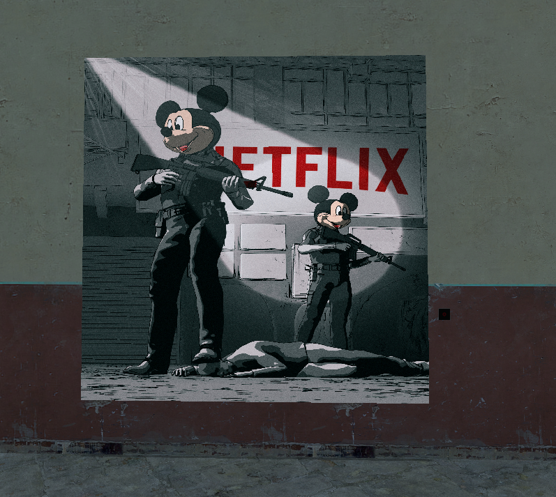

# expression2_image_server

Simple api to transform an image into a sequence of characters that can easily be parsed by expression 2 and be displayed on a digital screen.

## API
### Custom image
Downloads an image from the given `url` and returns back the encoded string.  
`url` must be percent encoded.  
Endpoint : `/custom/<url>`
#### Example
**Request** : `http://<host>/custom/https%3A%2F%2Fsteamcdn-a.akamaihd.net%2Fsteam%2Fapps%2F4000%2Fheader.jpg%3Ft%3D1601306982?&width=12&height=12`  
**Response** :
```
12x12;���������������������������������������������������������������������������������P������������������������������������������������������������������8�P�������������������������������5����������������������������������������<��������������������������������J��J������������������������e��x��^��|����������������������w�n�i��o��v����������������������v������z��z����������������������������~����������������������������
```

### Pre-existing image
Encodes one of the images already present in the server and returns back its encoded string.  
`name` is the filename of one of the available images.  
**Endpoint** : `/image/<name>`

## Expression 2 script example
```lua
@name Image Viewer
@inputs DigiScreen:wirelink
@persist WriteImageToDigiscreenState:table ServerData:string IMAGE_URL:string HOST:string
@trigger none

if(first())
{
    HOST = "https://expression2-image-server.d464.sh"
    IMAGE_URL = "https://cdna.artstation.com/p/assets/images/images/016/364/098/4k/beeple-02-27-19.jpg"
    
    function table writeImageToDigiscreen(State:table, Screen:wirelink, ImageData:string) {
        local Resolution = 512
        
        if(State:exists("done")){return State}
        
        if(!State:exists("init")){
            State["init", number] = 1
        }
        
        if(!perf(5)){return State}
        if(!State:exists("parsing_data"))
        {
            local SemiIndex = ImageData:find(";", 0)
            local ResString = ImageData:sub(0, SemiIndex - 1)
            local DataString = ImageData:sub(SemiIndex + 1)
            local WH = ResString:explode("x")
            local ResWidth = WH[1, string]:toNumber()
            local ResHeight = WH[2, string]:toNumber()
            
            State["width", number] = ResWidth
            State["height", number] = ResHeight
            State["data_string", string] = DataString
            State["parsing_data", number] = 1
            
            print("Image Width : " + toString(ResWidth))
            print("Image Height : " + toString(ResHeight))
        }
        
        if(!perf(5)){return State}
        if(!State:exists("screen_setup")) {
            #Init screen
            print("Screen setup")
            Screen[1048569 + 0] = 3
            Screen[1048569 + 3] = State["width", number]
            Screen[1048569 + 4] = State["height", number]
            Screen[1048569 + 5] = 0
            Screen[1048569 + 6] = 1
            
            State["screen_setup", number] = 1
        }
        
        if(!perf(5)){return State}
        
        if(!State:exists("X")){State["X", number] = 0}
        if(!State:exists("Y")){State["Y", number] = 0}
        
        local ResolutionWidth = State["width", number]
        local ResolutionHeight = State["height", number]
        local PixelData = State["data_string", string]
        
        local X = State["X", number]
        local Y =  State["Y", number]
        
        while(perf(120))
        {
            local PixelIndex = (X * ResolutionWidth + Y) * 3
            local PixelColor = vec(toByte(PixelData, PixelIndex + 1), toByte(PixelData, PixelIndex + 2), toByte(PixelData, PixelIndex + 3))
            Screen[X * ResolutionWidth + Y] = rgb2digi(PixelColor, 3)
            X++
            if (X == ResolutionWidth)
            {
                Y++
                X = 0
                if (Y == ResolutionHeight)
                {
                    State["done", number] = 1
                    break
                }
            }
        }
        
        if(!State:exists("done")){
            State["X", number] = X
            State["Y", number] = Y   
        }
        
        return State
    }
    
    runOnHTTP(1)

    timer("http_start_request", 100)
}
elseif(clk("http_start_request"))
{
    if(httpCanRequest() == 1){
        print("Starting request")
        RequestUrl = HOST + "/custom/" + httpUrlEncode(IMAGE_URL) + "?width=512&height=512"   
        print("Request url : " + RequestUrl)
        httpRequest(RequestUrl)
    }else{
        timer("http_start_request", 100)
    }
}
elseif(httpClk())
{
    ServerData = httpData() 
    timer("draw_image_data", 100)
}
elseif(clk("draw_image_data"))
{
    WriteImageToDigiscreenState = writeImageToDigiscreen(WriteImageToDigiscreenState, DigiScreen, ServerData)
    if(!WriteImageToDigiscreenState:exists("done")) {
        timer("draw_image_data", 50)
    }
}
```

Result

